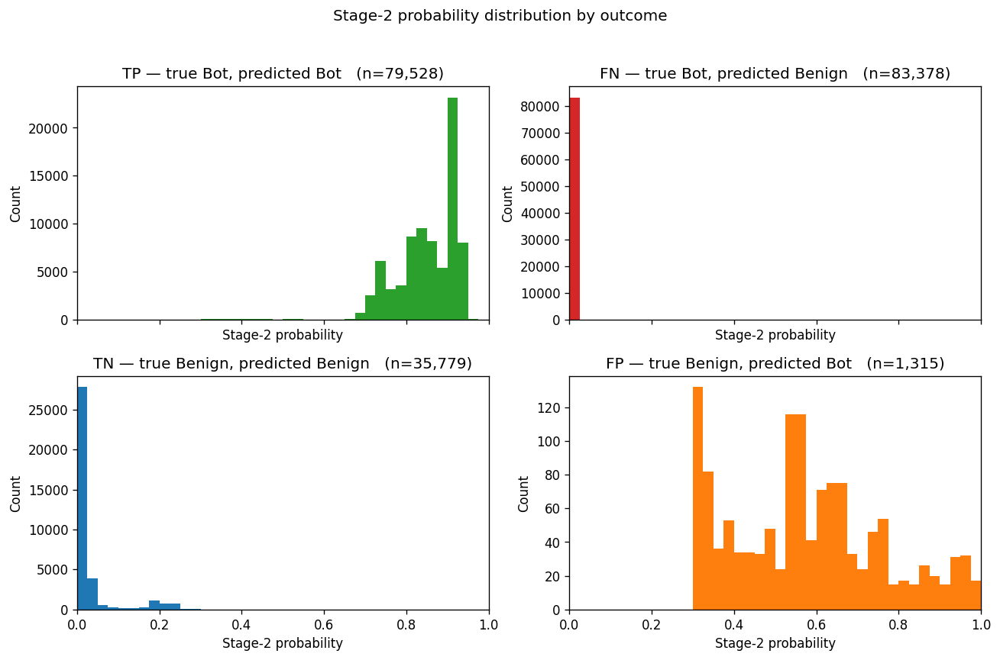

# Diagnostic Report — Friday-02-03-2018.csv

## 1. Probability Distribution Verdict

- FN probability quartiles `[25, 50, 75, 90, 99]`: `[0.006801009, 0.0068018986, 0.0068038865, 0.006808028, 0.006813379]`
- Fraction of FN with prob < 0.01: **99.8%**
- Fraction of FN with prob < 0.10: **99.9%**
- Verdict: **CONFIDENTLY WRONG on FN — threshold tuning won't help.**

## 2. Per-Destination-Port Recall

|   Dst Port |   botnet_flows |         tp |         fn |   recall |
|-----------:|---------------:|-----------:|-----------:|---------:|
|       8080 |    161154.0000 | 79528.0000 | 81626.0000 |   0.4935 |
|          0 |       156.0000 |     0.0000 |   156.0000 |   0.0000 |
|      51165 |         2.0000 |     0.0000 |     2.0000 |   0.0000 |
|      51163 |         2.0000 |     0.0000 |     2.0000 |   0.0000 |
|      51124 |         2.0000 |     0.0000 |     2.0000 |   0.0000 |
|      51123 |         2.0000 |     0.0000 |     2.0000 |   0.0000 |
|      51121 |         2.0000 |     0.0000 |     2.0000 |   0.0000 |
|      51120 |         2.0000 |     0.0000 |     2.0000 |   0.0000 |
|      51118 |         2.0000 |     0.0000 |     2.0000 |   0.0000 |
|      51116 |         2.0000 |     0.0000 |     2.0000 |   0.0000 |
|      51115 |         2.0000 |     0.0000 |     2.0000 |   0.0000 |
|      51114 |         2.0000 |     0.0000 |     2.0000 |   0.0000 |
|      51113 |         2.0000 |     0.0000 |     2.0000 |   0.0000 |
|      51112 |         2.0000 |     0.0000 |     2.0000 |   0.0000 |
|      51108 |         2.0000 |     0.0000 |     2.0000 |   0.0000 |

## 3. Per-Protocol Recall

|   Protocol |   botnet_flows |    tp |    fn |   recall | proto_name   |
|-----------:|---------------:|------:|------:|---------:|:-------------|
|          6 |         162750 | 79528 | 83222 |   0.4887 | TCP          |
|          0 |            156 |     0 |   156 |   0.0000 | HOPOPT       |

## 4. Feature Comparison FN vs TP

| feature           |   tp_median |   fn_median |   tp_p90 |   fn_p90 |   ratio_median |
|:------------------|------------:|------------:|---------:|---------:|---------------:|
| Flow Duration     |    10894.00 |      504.00 | 12858.30 |   655.00 |          21.62 |
| Tot Fwd Pkts      |        3.00 |        2.00 |     3.00 |     2.00 |           1.50 |
| Tot Bwd Pkts      |        4.00 |        0.00 |     4.00 |     0.00 |         inf    |
| TotLen Fwd Pkts   |      326.00 |        0.00 |   326.00 |     0.00 |         inf    |
| TotLen Bwd Pkts   |      129.00 |        0.00 |   129.00 |     0.00 |         inf    |
| Flow Byts/s       |    41762.28 |        0.00 | 46618.85 |     0.00 |         inf    |
| Flow Pkts/s       |      642.79 |     3968.25 |   717.88 |  4319.65 |           0.16 |
| Fwd Pkt Len Mean  |      108.67 |        0.00 |   108.67 |     0.00 |         inf    |
| Bwd Pkt Len Mean  |       32.25 |        0.00 |    32.25 |     0.00 |         inf    |
| SYN Flag Cnt      |        0.00 |        0.00 |     0.00 |     0.00 |         inf    |
| ACK Flag Cnt      |        0.00 |        1.00 |     0.00 |     1.00 |           0.00 |
| Init Fwd Win Byts |     8192.00 |     2052.00 |  8192.00 |  2052.00 |           3.99 |
